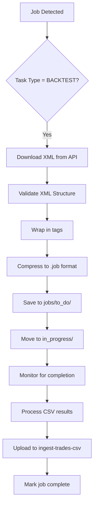
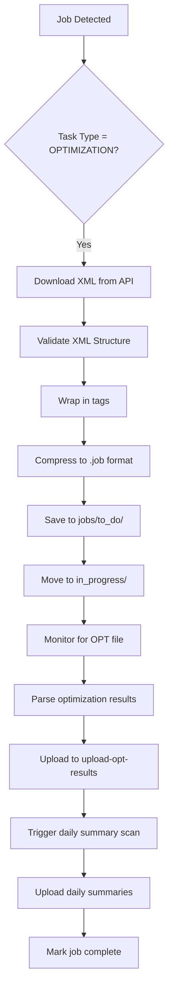
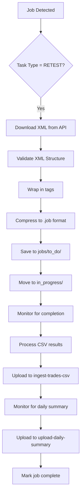
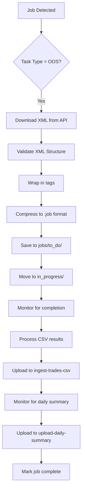
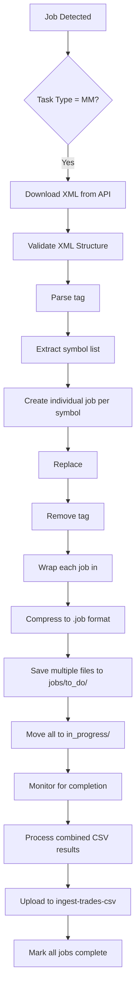
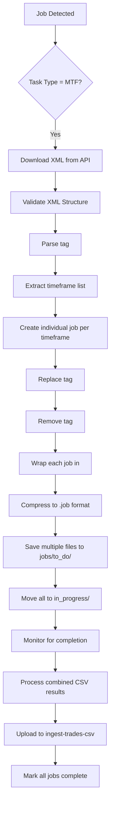
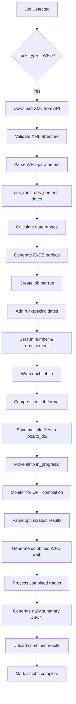
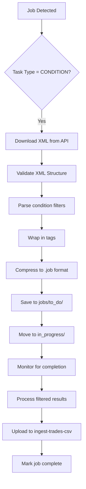

# Alpha Weaver ClientGUI Python Port Solution

**Version**: 1.0
**Date**: 2025-10-06
**Component**: clientgui Python port
**Purpose**: Comprehensive solution document for porting Alpha Weaver ClientGUI from Go to Python

---

## Executive Summary

This document provides a detailed analysis of the Alpha Weaver ClientGUI codebase and a complete solution for porting it to Python. The current Go implementation using Fyne GUI framework will be ported to Python using PySide6, maintaining all core functionalities while improving maintainability and extensibility.

## Table of Contents

1. [Current Go Implementation Analysis](#current-go-implementation-analysis)
2. [Python Framework Recommendation](#python-framework-recommendation)
3. [Architecture Mapping](#architecture-mapping)
4. [Task Type Processing Flowcharts](#task-type-processing-flowcharts)
5. [User Stories](#user-stories)
6. [Implementation Roadmap](#implementation-roadmap)
7. [Migration Strategy](#migration-strategy)

---

## Current Go Implementation Analysis

### Core Architecture Components

#### 1. **GUI Layer** (`gui.go`)
- **Framework**: Fyne (cross-platform desktop GUI)
- **Features**:
  - Authentication UI (email/password)
  - Real-time monitoring controls (start/stop)
  - Activity log with scrolling
  - Folder statistics display
  - Modern card-style layout

#### 2. **Authentication Manager** (`auth.go`)
- **JWT-based authentication** with Supabase
- **Token refresh** mechanism
- **Session persistence** across app restarts
- **Secure credential handling**

#### 3. **API Client** (`api.go`)
- **RESTful communication** with Alpha Weaver backend
- **Job polling** (`poll-jobs` endpoint)
- **File uploads**: CSV, OPT, Daily Summary
- **Task-specific XML processing**: MM, MTF, WFO expansion
- **Error handling and retry logic**

#### 4. **Download Manager** (`downloader.go`)
- **Concurrent XML downloads** with configurable limits
- **Task type processing**: MM/MTF/WFO job expansion
- **File compression** (.xml → .job using zlib)
- **XML validation** and regeneration for corrupted files
- **Retry logic** with exponential backoff

#### 5. **Upload Managers** (`csv_uploader.go`)
- **CSV Upload Manager**: Monitors `results/to_do/` for CSV files
- **OPT Upload Manager**: Monitors `opt/in/` for .opt files
- **Daily Summary Manager**: Monitors `opt/summary/` for .rep files
- **Metadata extraction** from filenames
- **Automatic file movement** (to_do → done/error)

#### 6. **Polling Optimizer** (`polling.go`)
- **Adaptive polling intervals** (5min - 30min)
- **Job availability detection**
- **Burst polling** triggered by upload events
- **Resource optimization**

#### 7. **File Management** (`file_manager.go`)
- **Cross-platform folder structure**
- **File status tracking** (to_do, in_progress, done, error)
- **Automatic cleanup and organization**

#### 8. **Compression System** (`compression.go`)
- **Zlib compression** matching TradeStation DLL settings
- **Bidirectional conversion** (.xml ↔ .job)

### Key Functionalities

1. **Multi-Task Type Support**: BACKTEST, OPTIMIZATION, RETEST, OOS, MM, MTF, WFO, WFM, DWFM, CONDITION
2. **Intelligent Job Expansion**: MM (multi-market), MTF (multi-timeframe), WFO (walk-forward optimization)
3. **Real-time File Monitoring**: Automatic upload processing
4. **Robust Error Handling**: Retry logic, corruption detection, regeneration
5. **Cross-platform Compatibility**: Windows, macOS, Linux
6. **24/7 Daemon Operation**: Continuous background processing

---

## Python Framework Recommendation

### Recommended Framework: **PySide6**

#### Why PySide6?

1. **Maturity and Stability**
   - 20+ years of development
   - Production-ready for enterprise applications
   - Extensive documentation and community support

2. **Cross-Platform Compatibility**
   - Native look and feel on Windows, macOS, Linux
   - Consistent API across platforms
   - Superior to Fyne's cross-platform approach

3. **Rich Feature Set**
   - Modern UI components (similar to Fyne's capabilities)
   - Excellent file system monitoring (`QFileSystemWatcher`)
   - Built-in networking (`QNetworkAccessManager`)
   - Threading support for background operations

4. **Performance**
   - Native compiled widgets (faster than web-based alternatives)
   - Efficient memory usage
   - Good for long-running applications

5. **Ecosystem Compatibility**
   - Seamless integration with scientific Python stack
   - Easy to extend with C++ modules if needed
   - Compatible with existing Python tooling

#### Alternative Considerations

| Framework | Pros | Cons | Suitability |
|-----------|------|------|-------------|
| **PySide6** | Qt-based, LGPL licensed for commercial use | Mature ecosystem, official Qt for Python | Primary recommendation |
| **PyQt6** | Qt-based, GPL licensed | Requires commercial license for closed-source applications | Alternative (GPL restriction) |
| **Tkinter** | Built-in, lightweight | Outdated UI, limited features | Not recommended |
| **Kivy** | Touch-friendly, modern | Mobile-focused, complex for desktop | Not suitable |
| **Dear PyGui** | Fast, modern | Immature, limited community | Not production-ready |

#### Recommended Python Stack

```python
# Core dependencies
PySide6>=6.5.0         # GUI framework
requests>=2.31.0      # HTTP client
watchdog>=3.0.0       # File monitoring
zlib-compress>=1.0.0  # Compression
pyjwt>=2.8.0          # JWT handling
```

---

## Architecture Mapping

### Go → Python Component Mapping

| Go Component | Python Equivalent | Key Changes |
|-------------|-------------------|-------------|
| `fyne.App` | `QApplication` | Main application loop |
| `fyne.Window` | `QMainWindow` | Main window container |
| `widget.*` | `QWidget` subclasses | UI components |
| `container.*` | `QLayout` subclasses | Layout management |
| `http.Client` | `requests.Session` | HTTP communication |
| `sync.WaitGroup` | `concurrent.futures` | Concurrency management |
| `filepath.Walk` | `os.walk` | File system operations |
| `time.Ticker` | `QTimer` | Periodic operations |

### Directory Structure (Python)

```
clientgui/
├── main.py                 # Application entry point
├── gui/
│   ├── main_window.py      # Main application window
│   ├── auth_dialog.py      # Authentication UI
│   ├── monitoring_panel.py # Control panel
│   └── log_viewer.py       # Activity log display
├── core/
│   ├── auth_manager.py     # Authentication handling
│   ├── api_client.py       # Backend communication
│   ├── download_manager.py # Job downloading
│   ├── upload_managers.py  # File upload handling
│   ├── polling_optimizer.py # Adaptive polling
│   └── file_manager.py     # File operations
├── utils/
│   ├── compression.py      # Zlib compression
│   ├── config.py           # Configuration management
│   └── logger.py           # Logging system
└── models/
    ├── job.py              # Job data structures
    └── upload_event.py     # Event definitions
```

---

## Task Type Processing Flowcharts

### BACKTEST Task Processing



**Detailed Step-by-Step Process:**

1. **Job Detection**: Client polls `poll-jobs` endpoint and receives job list
2. **Task Type Check**: Parse job XML to confirm `task_type` = "BACKTEST"
3. **XML Download**: Call `download-job-xml` endpoint with job_id parameter
4. **XML Validation**: Check for required tags (`job_id`, `Symbol`, `StartDate`, `EndDate`, etc.)
5. **Root Wrapping**: Enclose job XML in `<root>` tags for TradeStation compatibility
6. **Compression**: Apply zlib compression to create `.job` file format
7. **File Storage**: Save compressed file to `C:\AlphaWeaver\Files\jobs\to_do\` with naming pattern `{job_id}_{symbol}_{timeframe}_BACKTEST.job`
8. **Status Update**: Move file to `in_progress\` folder to indicate processing started
9. **Completion Monitoring**: Watch for corresponding CSV file in `results\to_do\` folder
10. **CSV Processing**: Extract metadata from filename (`{symbol}_{timeframe}_{job_id}.csv`)
11. **Result Upload**: POST CSV file to `ingest-trades-csv` endpoint with symbol/timeframe metadata
12. **Job Completion**: Update job status in database and move files to `done\` folders

### OPTIMIZATION Task Processing



**Detailed Step-by-Step Process:**

1. **Job Detection**: Client polls `poll-jobs` endpoint and identifies OPTIMIZATION task
2. **Task Type Check**: Confirm `task_type` = "OPTIMIZATION" in job configuration
3. **XML Download**: Retrieve strategy XML with optimization parameters from `download-job-xml`
4. **XML Validation**: Verify presence of `optimizableParameters`, `StartDate`, `EndDate`, etc.
5. **Root Wrapping**: Add `<root>` wrapper for TradeStation client compatibility
6. **Compression**: Convert XML to `.job` format using zlib compression
7. **File Storage**: Save as `{job_id}_{symbol}_{timeframe}_OPTIMIZATION.job` in `jobs\to_do\`
8. **Status Update**: Move to `in_progress\` to indicate TradeStation processing started
9. **OPT File Monitoring**: Watch `opt\in\` folder for `{job_id}_{symbol}_{timeframe}_opt.csv` file
10. **OPT Parsing**: Decompress and parse optimization results with parameter combinations
11. **Result Upload**: POST OPT data to `upload-opt-results` endpoint with job metadata
12. **Daily Summary Trigger**: After OPT upload, scan `opt\summary\` for related `.rep` files
13. **Summary Upload**: Upload daily performance reports to `upload-daily-summary` endpoint
14. **Completion**: Update job status and move all files to respective `done\` folders

### RETEST Task Processing



**Detailed Step-by-Step Process:**

1. **Job Detection**: Poll `poll-jobs` endpoint and identify RETEST task type
2. **Task Type Validation**: Confirm `task_type` = "RETEST" with `stage` = "Retest"
3. **XML Retrieval**: Download strategy configuration from `download-job-xml` endpoint
4. **XML Validation**: Check for required RETEST parameters (`StartDate`, `EndDate`, etc.)
5. **Root Element Addition**: Wrap XML in `<root>` tags for TradeStation processing
6. **File Compression**: Apply zlib compression to create `.job` file format
7. **File Placement**: Store as `{job_id}_{symbol}_{timeframe}_RETEST.job` in `jobs\to_do\`
8. **Processing Status**: Move file to `in_progress\` folder
9. **CSV Result Monitoring**: Watch `results\to_do\` for `{symbol}_{timeframe}_{job_id}.csv`
10. **CSV Metadata Extraction**: Parse filename to extract symbol, timeframe, and job_id
11. **Trade Data Upload**: POST CSV file to `ingest-trades-csv` endpoint
12. **Daily Summary Monitoring**: Watch `opt\summary\` for `{job_id}_{symbol}_{timeframe}_Daily.rep`
13. **Summary Upload**: Send daily performance report to `upload-daily-summary` endpoint
14. **Job Finalization**: Update database status and move all files to `done\` folders

### OOS (Out-of-Sample) Task Processing



**Detailed Step-by-Step Process:**

1. **Job Detection**: Identify OOS task through `poll-jobs` API polling
2. **Task Type Verification**: Confirm `task_type` = "OOS" in job configuration
3. **XML Download**: Fetch strategy XML with OOS-specific parameters
4. **XML Structure Check**: Validate presence of `is_start_date`, `is_end_date`, `os_start_date`, `os_end_date`
5. **Root Wrapping**: Add `<root>` element wrapper for TradeStation compatibility
6. **File Compression**: Convert to `.job` format using zlib compression
7. **File Storage**: Save as `{job_id}_{symbol}_{timeframe}_OOS.job` in `jobs\to_do\`
8. **Status Transition**: Move file to `in_progress\` folder
9. **Completion Monitoring**: Watch for CSV results in `results\to_do\` folder
10. **CSV Processing**: Extract metadata from filename pattern
11. **Result Upload**: Send trade data to `ingest-trades-csv` endpoint
12. **Summary Monitoring**: Watch for daily performance report in `opt\summary\`
13. **Summary Upload**: POST daily summary to `upload-daily-summary` endpoint
14. **Job Completion**: Update status and move files to `done\` folders

### MM (Multi-Market) Task Processing



**Detailed Step-by-Step Process:**

1. **Job Detection**: Poll `poll-jobs` and identify MM task type
2. **Task Type Confirmation**: Verify `task_type` = "MM" with `<symbols>` tag present
3. **XML Download**: Retrieve single MM job configuration from API
4. **XML Validation**: Check for required `<symbols>` tag with comma-separated values
5. **Symbol Parsing**: Extract symbol list from `<symbols>@ES,@NQ,@YM</symbols>` format
6. **Job Multiplication**: Create individual job XML for each symbol in the list
7. **Symbol Replacement**: Replace `<Symbol>` tag with specific symbol for each job
8. **Tag Cleanup**: Remove `<symbols>` tag from individual job copies
9. **Root Wrapping**: Add `<root>` wrapper to each individual job XML
10. **File Compression**: Compress each job XML to `.job` format
11. **Multi-File Storage**: Save as `{job_id}_{symbol}_{timeframe}_MM.job` for each symbol
12. **Status Updates**: Move all generated job files to `in_progress\` folder
13. **Completion Monitoring**: Watch for CSV results from all symbols
14. **Combined Processing**: Process trade results from multiple symbol CSVs
15. **Result Upload**: Upload combined trade data to `ingest-trades-csv` endpoint
16. **Job Completion**: Mark all related jobs as complete in database

### MTF (Multi-Timeframe) Task Processing



**Detailed Step-by-Step Process:**

1. **Job Detection**: Identify MTF task through API polling
2. **Task Type Verification**: Confirm `task_type` = "MTF" with `<timeframes>` tag
3. **XML Retrieval**: Download single MTF job configuration
4. **XML Structure Validation**: Verify `<timeframes>` tag contains comma-separated values
5. **Timeframe Extraction**: Parse timeframe list from `<timeframes>60,240,1440</timeframes>`
6. **Job Expansion**: Generate individual job XML for each timeframe
7. **Timeframe Replacement**: Update `<Timeframe>` tag with specific timeframe value
8. **Tag Removal**: Delete `<timeframes>` tag from individual job copies
9. **Root Element Addition**: Wrap each job in `<root>` tags
10. **File Compression**: Convert each XML to `.job` format using zlib
11. **Multi-File Creation**: Save as `{job_id}_{symbol}_{timeframe}_MTF.job` for each timeframe
12. **Status Management**: Move all generated files to `in_progress\` folder
13. **Completion Tracking**: Monitor for CSV results from all timeframe executions
14. **Result Aggregation**: Combine trade data from multiple timeframe CSVs
15. **Upload Processing**: Send aggregated results to `ingest-trades-csv` endpoint
16. **Finalization**: Mark all related jobs as complete

### WFO (Walk-Forward Optimization) Task Processing



**Detailed Step-by-Step Process:**

1. **Job Detection**: Identify WFO task through `poll-jobs` API calls
2. **Task Type Confirmation**: Verify `task_type` = "WFO", "WFM", or "DWFM"
3. **XML Download**: Retrieve WFO configuration with optimization parameters
4. **Parameter Validation**: Check for `oos_runs`, `oos_percent`, `startDate`, `endDate`
5. **WFO Parameter Extraction**: Parse number of runs and OOS percentage
6. **Date Range Calculation**: Compute IS/OS periods using WFO algorithm
7. **Period Generation**: Create overlapping in-sample/out-of-sample date ranges
8. **Job Creation**: Generate individual XML job for each WFO run
9. **Date Tag Addition**: Add run-specific `is_start_date`, `is_end_date`, `os_start_date`, `os_end_date`
10. **Run Configuration**: Set `run` number and `oos_percent` for each job
11. **Root Wrapping**: Add `<root>` wrapper to each job XML
12. **File Compression**: Convert all jobs to `.job` format
13. **Multi-File Storage**: Save as `{job_id}_{symbol}_{timeframe}_WFO_run{run}.job`
14. **Status Management**: Move all run files to `in_progress\` folder
15. **OPT Monitoring**: Wait for optimization results from all WFO runs
16. **Result Parsing**: Decompress and parse OPT files with parameter combinations
17. **Combined XML Generation**: Create secondary XML with fixed optimized parameters
18. **Trade Processing**: Execute combined strategy with optimized parameters
19. **Daily Summary Creation**: Generate continuous equity curve JSON from trade data
20. **Result Upload**: Send combined WFO results to backend endpoints
21. **Job Completion**: Mark all WFO run jobs as complete

### CONDITION Task Processing



**Detailed Step-by-Step Process:**

1. **Job Detection**: Identify CONDITION task through API polling
2. **Task Type Verification**: Confirm `task_type` = "CONDITION" in job config
3. **XML Download**: Retrieve strategy XML with condition filter parameters
4. **XML Validation**: Check for condition filter definitions and criteria
5. **Filter Parsing**: Extract condition rules (field, operator, value combinations)
6. **Root Wrapping**: Add `<root>` element wrapper for TradeStation compatibility
7. **File Compression**: Convert XML to `.job` format using zlib compression
8. **File Storage**: Save as `{job_id}_{symbol}_{timeframe}_CONDITION.job` in `jobs\to_do\`
9. **Status Update**: Move file to `in_progress\` folder
10. **Completion Monitoring**: Watch for filtered result CSV in `results\to_do\`
11. **Result Processing**: Apply condition filters to trade data if needed
12. **Upload Execution**: Send filtered results to `ingest-trades-csv` endpoint
13. **Job Completion**: Update database status and move files to `done\` folders

---

## User Stories

### Trader Persona

**As a professional trader**, I want to:
- Submit strategy backtests and receive results within minutes
- Monitor multiple strategies simultaneously across different markets
- View real-time progress of long-running optimization jobs
- Receive notifications when jobs complete or fail
- Access historical performance data for strategy comparison

**Acceptance Criteria:**
- Job submission through web interface triggers immediate client processing
- Real-time status updates in both web and desktop applications
- Automatic result processing and upload without manual intervention
- Clear error messages and retry mechanisms for failed operations

### Strategy Developer Persona

**As a quantitative strategy developer**, I want to:
- Run walk-forward optimization across multiple time periods
- Test strategies on multiple markets simultaneously
- Compare in-sample vs out-of-sample performance automatically
- Generate comprehensive performance reports
- Debug strategy logic using detailed trade-by-trade data

**Acceptance Criteria:**
- WFO jobs automatically split into IS/OS periods
- Multi-market jobs expand to individual market processing
- Combined equity curves maintain chronological accuracy
- Performance metrics calculated across all runs
- Easy access to raw trade data for analysis

### System Administrator Persona

**As a system administrator**, I want to:
- Monitor client health and performance metrics
- Configure polling intervals and resource limits
- View comprehensive logs for troubleshooting
- Manage file system organization and cleanup
- Ensure reliable 24/7 operation

**Acceptance Criteria:**
- Real-time monitoring dashboard with key metrics
- Configurable logging levels and retention
- Automatic error recovery and retry logic
- File system monitoring and alerts
- Performance optimization based on system resources

### IT Operations Persona

**As an IT operations specialist**, I want to:
- Deploy client updates without service interruption
- Monitor network connectivity and API health
- Scale client instances based on job volume
- Implement security best practices
- Ensure compliance with data protection requirements

**Acceptance Criteria:**
- Zero-downtime deployment capabilities
- Comprehensive health checks and monitoring
- Secure credential management
- Audit trails for all operations
- Automated backup and recovery procedures

---

## Implementation Roadmap

### Phase 1: Core Infrastructure (4 weeks)

1. **Project Setup**
   - Initialize Python project with PySide6
   - Set up virtual environment and dependencies
   - Create basic directory structure

2. **Authentication System**
   - Port JWT authentication from Go
   - Implement token refresh mechanism
   - Create login UI components

3. **Basic GUI Framework**
   - Main window with modern styling
   - Activity log viewer
   - Basic control panels

### Phase 2: Core Functionality (6 weeks)

4. **API Client**
   - Port all REST API calls
   - Implement retry logic and error handling
   - Add XML processing functions

5. **Download Manager**
   - Concurrent download implementation
   - Task type processing (MM, MTF, WFO)
   - File compression system

6. **Upload Managers**
   - CSV upload monitoring
   - OPT file processing
   - Daily summary handling

### Phase 3: Advanced Features (4 weeks)

7. **Polling Optimizer**
   - Adaptive polling algorithm
   - Burst polling implementation
   - Resource optimization

8. **File Management**
   - Cross-platform file operations
   - Status tracking and cleanup
   - Error handling and recovery

### Phase 4: Testing & Optimization (3 weeks)

9. **Comprehensive Testing**
   - Unit tests for all components
   - Integration tests with Alpha Weaver backend
   - Cross-platform testing

10. **Performance Optimization**
    - Memory usage optimization
    - UI responsiveness improvements
    - Background processing efficiency

---

## Migration Strategy

### Parallel Development Approach

1. **Maintain Go Version**: Keep existing Go client operational
2. **Develop Python Version**: Build new implementation alongside
3. **Feature Parity Testing**: Ensure identical functionality
4. **Gradual Rollout**: Migrate users incrementally
5. **Fallback Support**: Maintain Go version as backup

### Compatibility Requirements

- **API Compatibility**: All backend endpoints remain unchanged
- **File Format Compatibility**: .job compression, XML structure
- **Folder Structure**: Maintain existing directory layout
- **Configuration**: Support existing config patterns

### Success Metrics

- **Functional Parity**: 100% feature compatibility
- **Performance**: Equivalent or better performance metrics
- **Stability**: Zero crashes in production testing
- **User Experience**: Improved UI responsiveness
- **Maintainability**: Easier code maintenance and extension

---

## Technical Specifications

### Python Dependencies

```python
# requirements.txt
PySide6>=6.5.0
requests>=2.31.0
watchdog>=3.0.0
PyJWT>=2.8.0
python-dotenv>=1.0.0
zlib-compress>=1.0.0
```

### Key Classes and Methods

```python
class AlphaWeaverClient(QApplication):
    """Main application class"""
    
class MainWindow(QMainWindow):
    """Main application window"""
    
class AuthManager:
    """JWT authentication handling"""
    
class APIClient:
    """Backend communication"""
    
class DownloadManager:
    """Job download and processing"""
    
class UploadManager:
    """File upload coordination"""
    
class PollingOptimizer:
    """Adaptive polling logic"""
```

### Configuration Management

```python
@dataclass
class Config:
    supabase_url: str
    supabase_key: str
    poll_interval: int
    max_concurrent: int
    # ... other settings
```

---

## Risk Assessment and Mitigation

### Technical Risks

1. **PyQt6 Learning Curve**
   - **Mitigation**: Comprehensive documentation, pair programming with experienced developers

2. **Cross-Platform Compatibility**
   - **Mitigation**: Early testing on all target platforms, CI/CD pipeline

3. **Performance Regression**
   - **Mitigation**: Performance benchmarking, optimization profiling

### Business Risks

1. **Extended Development Timeline**
   - **Mitigation**: Phased approach, parallel development

2. **User Disruption**
   - **Mitigation**: Gradual rollout, fallback availability

3. **Feature Gaps**
   - **Mitigation**: Detailed requirements analysis, comprehensive testing

---

## Conclusion

The Python port of Alpha Weaver ClientGUI using PySide6 provides a modern, maintainable, and feature-rich alternative to the current Go implementation. The comprehensive analysis ensures all critical functionalities are preserved while improving the development experience and user interface.

**Recommended Next Steps:**
1. Begin Phase 1 development with core infrastructure
2. Establish testing framework early in development
3. Plan for gradual user migration starting with beta testers
4. Monitor performance metrics throughout development

---

**Document Status**: Ready for Implementation
**Last Updated**: 2025-10-06
**Maintained By**: Alpha Weaver Development Team
**Next Review**: After Phase 1 completion