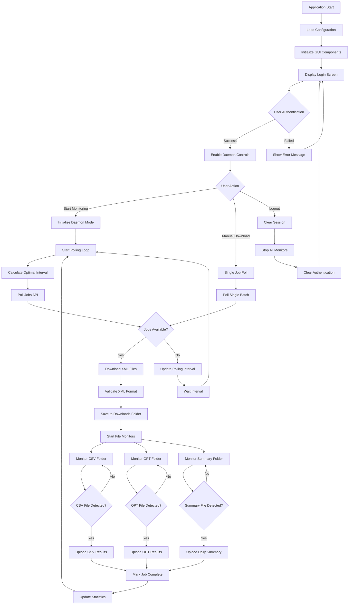

# Alpha Weaver GUI Client

A cross-platform desktop application built with Go and Fyne for automated trading strategy execution. The client handles the complete workflow from job polling to results processing, enabling seamless integration between Alpha Weaver's web platform and TradeStation's execution engine.

## 🎯 Key Capabilities

- **Multi-Market (MM) Task Processing**: Intelligent expansion of MM jobs with multiple symbols into individual job files
- **Task Type-Specific Processing**: Different handling logic for BACKTEST, OPTIMIZATION, RETEST, OOS, MM, WFO, WFM, DWFM, and other task types
- **Compressed Job Storage**: XML files are compressed to .job format using zlib compression for efficient storage
- **Intelligent XML Validation**: Automatic detection and regeneration of corrupted XML files with empty data streams

## 🎯 Core Purpose

This GUI client acts as a bridge between:
- **Alpha Weaver Platform**: Web-based strategy development and job management
- **TradeStation**: Desktop trading platform for strategy execution  
- **Local File System**: Automated file management and processing

## ✨ Key Features

- 🔐 **Secure Authentication**: JWT-based login with Alpha Weaver credentials
- 🤖 **Intelligent Job Polling**: Adaptive polling intervals based on job availability
- 📥 **Smart XML Downloads**: Downloads and processes strategy configuration files for TradeStation
  - **MM Task Expansion**: Automatically expands Multi-Market jobs into individual symbol jobs
  - **MTF Task Expansion**: Automatically expands Multi-Timeframe jobs into individual timeframe jobs
  - **WFO Date Calculation**: Automatically calculates and adds WFO run-specific dates for WFO, WFM, and DWFM tasks
  - **XML Compression**: Compresses downloaded XML to .job format using zlib
  - **Auto-Validation**: Detects and regenerates corrupted XML files
- 📤 **Multi-Format File Upload**: Handles CSV results, OPT files, and daily summaries
- 🔄 **24/7 Daemon Mode**: Continuous monitoring with smart resource management
- ⚡ **Concurrent Processing**: Configurable parallel downloads and uploads
- 🔁 **Robust Retry Logic**: Exponential backoff for network reliability
- 📊 **Real-time Monitoring**: Live activity logs and folder statistics
- 🖥️ **Cross-platform Support**: Windows, macOS, and Linux compatibility

## 🏗️ Application Architecture

### Core Components

#### 1. **GUI Layer** (`gui.go`)
- Fyne-based cross-platform interface
- Real-time status updates and logging
- User authentication and daemon control

#### 2. **Authentication Manager** (`auth.go`)
- JWT token management and refresh
- Secure credential storage
- Session persistence

#### 3. **API Client** (`api.go`)
- RESTful communication with Alpha Weaver backend
- Job polling and file upload endpoints
- Error handling and retry logic

#### 4. **Download Manager** (`downloader.go`)
- Concurrent XML file downloads with MM and MTF task expansion
- WFO/WFM/DWFM date calculation and XML enhancement
- File integrity validation and automatic XML regeneration
- TradeStation XML format compliance with root element wrapping
- Compression to .job format for efficient storage

#### 5. **Upload Managers** (`csv_uploader.go`)
- **CSV Upload Manager**: Monitors `results/to_do/` for CSV files, uploads to `ingest-trades-csv` endpoint
- **OPT Upload Manager**: Monitors `opt/in/` for .opt files, uploads to `upload-opt-results` endpoint
- **Daily Summary Upload Manager**: Monitors `opt/summary/` for .rep files, uploads to `upload-daily-summary` endpoint
- **Metadata Extraction**: Parses job_id, symbol, and timeframe from filenames
- **Error Handling**: Moves failed uploads to error folders for manual review

#### 6. **Polling Optimizer** (`polling.go`)
- Adaptive polling intervals (5min → 30min)
- Job availability-based optimization
- Resource-efficient 24/7 operation

#### 7. **File Manager** (`file_manager.go`)
- Folder structure management
- File validation and cleanup
- Statistics tracking

## 📊 Application Flow Diagram



## 🔄 Detailed Process Flow

### 1. Authentication Flow
```
User Input → JWT Request → Token Storage → API Client Setup → Enable Features
```

### 2. Job Polling Flow
```
API Poll → Job Detection → XML Download → Task Processing (MM/MTF/WFO) → Compression → File Validation → Folder Monitoring
```

#### Task Processing Details
```
MM Job: Extract Symbols → Generate Individual Jobs → Root Wrap → Compress to .job
MTF Job: Extract Timeframes → Generate Individual Jobs → Root Wrap → Compress to .job
WFO Job: Calculate Date Ranges → Generate Run-Specific Jobs → Add Date Tags → Root Wrap → Compress to .job
```

### 3. File Processing Flow
```
File Detection → Metadata Extraction → Upload API Call → Status Update → Cleanup
```

### 4. Polling Optimization Flow
```
Job Count Analysis → Interval Calculation → Resource Management → Next Poll Schedule
```

## 🎯 Task Type Processing

The clientgui handles different task types with specialized processing logic:

### MM (Multi-Market) Tasks - Special Processing

**Detection Criteria** (`api.go:341-344`):
- Contains `<task_type>MM</task_type>` in XML
- Contains `<symbols>symbol1,symbol2,symbol3</symbols>` tag

**Processing Flow** (`api.go:378-427`):
1. **Symbol Extraction**: Parse comma-separated symbols from `<symbols>` tag
2. **Job Multiplication**: Create individual job XML for each symbol
3. **Symbol Replacement**: Replace `<Symbol>` tag with specific symbol
4. **Tag Cleanup**: Remove `<symbols>` tag from individual jobs
5. **Root Wrapping**: Wrap all jobs in `<root>` element
6. **Filename Safety**: Replace commas with hyphens in filenames

**Example MM Processing**:
```xml
<!-- Input: Single MM Job -->
<Job>
  <task_type>MM</task_type>
  <Symbol>@ES</Symbol>
  <symbols>@ES,@NQ,@YM</symbols>
  <!-- other job data -->
</Job>

<!-- Output: Multiple Individual Jobs -->
<root>
  <Job>
    <task_type>MM</task_type>
    <Symbol>@ES</Symbol>
    <!-- other job data -->
  </Job>
  <Job>
    <task_type>MM</task_type>
    <Symbol>@NQ</Symbol>
    <!-- other job data -->
  </Job>
  <Job>
    <task_type>MM</task_type>
    <Symbol>@YM</Symbol>
    <!-- other job data -->
  </Job>
</root>
```

### MTF (Multi-Timeframe) Tasks - Special Processing

**Detection Criteria** (`api.go:481-528`):
- Contains `<task_type>MTF</task_type>` in XML
- Contains `<timeframes>tf1,tf2,tf3</timeframes>` tag

**Processing Flow**:
1. **Timeframe Extraction**: Parse comma-separated timeframes from `<timeframes>` tag
2. **Job Multiplication**: Create individual job XML for each timeframe
3. **Timeframe Replacement**: Replace `<Timeframe>` tag with specific timeframe
4. **Tag Cleanup**: Remove `<timeframes>` tag from individual jobs
5. **Root Wrapping**: Wrap all jobs in `<root>` element

### WFO (Walk-Forward Optimization) Tasks - Date Calculation

**Detection Criteria** (`api.go:574-676`):
- Contains `<task_type>WFO</task_type>`, `<task_type>WFM</task_type>`, or `<task_type>DWFM</task_type>` in XML
- Contains `<oos_runs>` tag with number of runs

**Processing Flow**:
1. **Parameter Extraction**: Parse `oos_runs`, `oos_percent`, `startDate`, `endDate`
2. **Date Calculation**: Calculate IS/OS periods for each run using WFO algorithm
3. **Job Generation**: Create individual job XML for each WFO run
4. **Date Enhancement**: Add run-specific date tags for TSClient:
   - `<startDate>`: Full period start (IS start date)
   - `<endDate>`: Full period end (OS end date for regular runs, IS end for final run)
   - `<is_start_date>`: In-sample start date (for TradeStation internal logic)
   - `<is_end_date>`: In-sample end date (used by TradeStation OutSample.SetAfterDate)
   - `<os_start_date>`: Out-of-sample start date (metadata/reporting)
   - `<os_end_date>`: Out-of-sample end date (metadata/reporting)
5. **Run Configuration**: Set `<run>` number and `<oos_percent>` for each job
6. **Final Run Handling**: Last run has IS-only period with `oos_percent=0.0`

**WFO Algorithm Implementation** (`api.go:695-771`):
- **Overlapping Windows**: Each run's IS period overlaps with previous run's OS end
- **Fixed OOS Percentage**: Maintains consistent train/test split
- **Extra Final Run**: Generates n+1 runs for future parameter optimization

**Example WFO Processing**:
```xml
<!-- Input: Single WFO Job -->
<Job>
  <task_type>WFO</task_type>
  <Symbol>@ES</Symbol>
  <startDate>2007-01-01</startDate>
  <endDate>2013-09-08</endDate>
  <oos_runs>3</oos_runs>
  <oos_percent>20</oos_percent>
  <!-- other job data -->
</Job>

<!-- Output: Multiple WFO Run Jobs (TSClient Compatible) -->
<root>
  <Job>
    <task_type>WFO</task_type>
    <Symbol>@ES</Symbol>
    <run>1</run>
    <!-- TSClient uses these for full period coverage -->
    <startDate>2007-01-01</startDate>        <!-- IS start -->
    <endDate>2013-09-08</endDate>           <!-- OS end -->
    <!-- TradeStation uses these for IS/OS split -->
    <is_start_date>2007-01-01</is_start_date>
    <is_end_date>2012-05-07</is_end_date>   <!-- OutSample.SetAfterDate(is_end_date) -->
    <os_start_date>2012-05-08</os_start_date>
    <os_end_date>2013-09-08</os_end_date>
    <oos_percent>20</oos_percent>
    <!-- other job data -->
  </Job>
  <Job>
    <task_type>WFO</task_type>
    <Symbol>@ES</Symbol>
    <run>2</run>
    <!-- Full period: IS + OS -->
    <startDate>2008-05-04</startDate>        <!-- IS start -->
    <endDate>2015-01-10</endDate>           <!-- OS end -->
    <!-- IS/OS boundaries for TradeStation -->
    <is_start_date>2008-05-04</is_start_date>
    <is_end_date>2013-09-08</is_end_date>   <!-- OutSample boundary -->
    <os_start_date>2013-09-09</os_start_date>
    <os_end_date>2015-01-10</os_end_date>
    <oos_percent>20</oos_percent>
    <!-- other job data -->
  </Job>
  <!-- Additional runs... -->
</root>
```

### 🔄 Clientgui → TSClient → TradeStation Integration

#### **Complete WFO Processing Chain**

**1. Clientgui WFO Processing** (`api.go:574-676`):
```go
// For each WFO run, clientgui sets:
jobXML = replaceXMLTag(jobXML, "startDate", dateRange.ISStartDate)     // IS start
jobXML = replaceXMLTag(jobXML, "endDate", dateRange.GetEndDate())      // OS end (or IS end for final run)
jobXML = addXMLTag(jobXML, "is_start_date", dateRange.ISStartDate)     // IS boundary
jobXML = addXMLTag(jobXML, "is_end_date", dateRange.ISEndDate)         // IS/OS split point
jobXML = addXMLTag(jobXML, "os_start_date", dateRange.OSStartDate)     // OS boundary
jobXML = addXMLTag(jobXML, "os_end_date", dateRange.OSEndDate)         // OS boundary
```

**2. TSClient Date Usage Logic** (`AW TS 10 Client.el:1601-1620`):
```easylanguage
// TSClient correctly uses run-specific dates:
IS_start_date = getDate("is_start_date", Settings);    // ✅ Uses IS start date
IS_end_date = getDate("is_end_date", Settings);        // ✅ Uses IS end date
OS_start_date = getDate("os_start_date", Settings);    // ✅ Uses OS start date
OS_end_date = end_date;                                // ✅ Uses full period end

// CRITICAL: TSClient sets TradeStation's OOS boundary
job.Settings.OutSample.SetAfterDate(is_end_date);
```

**3. TradeStation Internal Processing**:
```easylanguage
// TradeStation loads full period: startDate to endDate
// TradeStation splits periods using OutSample.SetAfterDate(is_end_date):
//   - In-Sample: startDate to is_end_date (for optimization)
//   - Out-of-Sample: (is_end_date + 1 day) to endDate (for validation)
```

#### **Why This Three-Layer Design Works**

**Clientgui Layer**:
- ✅ **Date Calculation**: Implements sophisticated WFO algorithm with overlapping windows
- ✅ **XML Generation**: Provides all necessary date tags for TSClient consumption
- ✅ **Run Management**: Handles multiple WFO runs with proper boundary calculation

**TSClient Layer**:
- ✅ **Date Extraction**: Reads run-specific dates from clientgui-generated XML
- ✅ **TradeStation Configuration**: Sets full period (`start_date` to `end_date`) for data loading
- ✅ **OOS Boundary Setting**: Configures `OutSample.SetAfterDate(is_end_date)` for IS/OS split

**TradeStation Layer**:
- ✅ **Single Data Load**: Loads continuous dataset from `start_date` to `end_date`
- ✅ **Automatic IS/OS Split**: Uses `OutSample.SetAfterDate` to divide periods internally
- ✅ **Optimization**: Runs parameter optimization on IS period only
- ✅ **Validation**: Tests optimized parameters on OS period only

#### **Date Flow Example (Run 1)**
```
Clientgui Calculation:
├── startDate: 2007-01-01        (Full period start)
├── endDate: 2013-09-08          (Full period end)
├── is_start_date: 2007-01-01    (IS period start)
├── is_end_date: 2012-05-07      (IS period end / OOS split point)
├── os_start_date: 2012-05-08    (OS period start)
└── os_end_date: 2013-09-08      (OS period end)

TSClient Usage:
├── start_date = startDate = 2007-01-01          (TradeStation data load start)
├── end_date = endDate = 2013-09-08              (TradeStation data load end)
└── job.Settings.OutSample.SetAfterDate(2012-05-07)  (IS/OS boundary)

TradeStation Processing:
├── Data Load: 2007-01-01 to 2013-09-08         (Single continuous dataset)
├── IS Period: 2007-01-01 to 2012-05-07         (Optimization data)
└── OS Period: 2012-05-08 to 2013-09-08         (Validation data)
```

#### **Integration Benefits**
- **Efficiency**: Single data load covers both IS and OS periods
- **Accuracy**: No gaps or overlaps between IS and OS periods
- **Flexibility**: Clientgui can adjust WFO algorithm without changing TSClient
- **Reliability**: TradeStation handles IS/OS split internally using proven `OutSample` functionality

### Standard Task Types - Regular Processing

**BACKTEST, OPTIMIZATION, RETEST, OOS, etc.**:
- Direct XML download without expansion
- Single job per XML file
- Standard compression to .job format
- Root element wrapping: `<root>{xml_content}</root>`

### XML Processing & Validation

**Compression** (`compression.go`):
- All XML files compressed to `.job` format using zlib
- Matches boost::iostreams::zlib_compressor settings
- Original XML deleted after successful compression

**Validation & Regeneration** (`downloader.go:411-468`):
- Detects empty data streams: `<item></item>`, `<market/>`, `<timeframe/>`
- Automatically triggers force regeneration via API
- Downloads fresh XML with valid data

**Root Wrapping** (`api.go:354`):
- **CRITICAL**: All XML content wrapped in `<root></root>` tags
- Required for proper TradeStation client processing
- **NEVER remove this wrapping logic**

## 📁 File Structure & Management

### Current Folder Structure (C:\AlphaWeaver\Files)
```
C:\AlphaWeaver\Files/
├── jobs/                    # Job XML files
│   ├── to_do/              # New jobs (.job compressed format)
│   ├── in_progress/        # Currently processing
│   ├── done/               # Completed jobs
│   └── error/              # Failed jobs
├── results/                # TradeStation output files
│   ├── to_do/              # CSV files ready for upload
│   ├── done/               # Successfully uploaded CSV files
│   ├── temp/               # Temporary processing files
│   ├── csv/                # CSV archive
│   └── trades/             # Trade detail files
└── opt/                    # Optimization artifacts
    ├── in/                 # .opt files ready for upload
    ├── done/               # Successfully uploaded .opt files
    ├── error/              # Failed .opt uploads
    └── summary/            # Daily summary .rep files
```

### File Types & Processing

#### Input Files (Downloaded)
- **Compressed Job Files**: `.job` format (zlib compressed XML)
- **Raw XML Debugging**: `*_raw.xml` files saved for MM task debugging
- **MM Task Expansion**: Single MM job → Multiple individual job files
- **Redownload Logic**: Handles job reprocessing with force regeneration

#### Output Files (Uploaded)
- **CSV Files**: Strategy execution results with P&L data
- **OPT Files**: Optimization results and parameters
- **Daily Summary Files**: `.rep` files with daily performance data

#### File Naming Conventions
- **Job Files**: `{job_id}_{symbol}_{timeframe}_{task_type}.job`
  - MM Example: `abc123_@ES-@NQ_60_MM.job` (commas replaced with hyphens)
- **CSV Files**: `{symbol}_{timeframe}_{job_id}.csv`
- **OPT Files**: `{job_id}_{symbol}_{timeframe}_opt.csv`
- **Daily Summary**: `{job_id}_{symbol}_{timeframe}_Daily.rep`

## 🤖 Intelligent Polling Strategy

### Adaptive Intervals
- **Active Period**: 5 minutes when jobs available
- **Quiet Period**: Scales up to 30 minutes when no jobs
- **Trigger Threshold**: Remaining jobs ≤ 3 maintains frequent polling
- **Empty Poll Backoff**: 3 consecutive empty polls → extended interval

### Resource Optimization
- **Concurrent Downloads**: Configurable limits (default: 5)
- **Memory Management**: Streaming file processing
- **Network Efficiency**: Conditional requests and compression

## 🔄 Detailed Polling & Processing Logic

### 1. Job Download Polling (`api.go`)

#### Polling Endpoint
```go
// Primary polling endpoint for job detection
GET /rest/v1/rpc/poll_jobs
Headers:
- Authorization: Bearer {jwt_token}
- apikey: {supabase_anon_key}
```

#### Polling Logic Flow
```go
func (c *APIClient) PollJobs() ([]Job, error) {
    // 1. Make authenticated request to poll_jobs endpoint
    resp, err := c.makeAuthenticatedRequest("GET", "/rest/v1/rpc/poll_jobs", nil)

    // 2. Parse response into Job structures
    var jobs []Job
    json.Unmarshal(resp, &jobs)

    // 3. Filter jobs by status and availability
    availableJobs := filterAvailableJobs(jobs)

    // 4. Update polling metrics for adaptive intervals
    c.updatePollingMetrics(len(availableJobs))

    return availableJobs, nil
}
```

#### Adaptive Polling Algorithm
```go
func calculateNextPollInterval(jobCount int, consecutiveEmptyPolls int) time.Duration {
    baseInterval := 5 * time.Minute

    switch {
    case jobCount > 3:
        return baseInterval // Frequent polling when jobs available
    case consecutiveEmptyPolls >= 3:
        return min(30*time.Minute, baseInterval*time.Duration(consecutiveEmptyPolls))
    default:
        return baseInterval * 2 // Moderate scaling
    }
}
```

### 2. XML File Downloads (`downloader.go`)

#### Download Process Flow
```go
func (d *Downloader) DownloadJob(job Job) error {
    // 1. Create download request with job ID
    url := fmt.Sprintf("/rest/v1/rpc/download_job_xml?job_id=%s", job.ID)

    // 2. Make authenticated request for XML content
    xmlContent, err := d.client.makeAuthenticatedRequest("GET", url, nil)

    // 3. Validate XML structure and detect corrupted files
    if isCorruptedXML(xmlContent) {
        return d.regenerateJob(job.ID)
    }

    // 4. Process based on task type
    if job.TaskType == "MM" {
        return d.processMultiMarketJob(job, xmlContent)
    }

    // 5. Apply root wrapping for TradeStation compatibility
    wrappedXML := fmt.Sprintf("<root>%s</root>", xmlContent)

    // 6. Compress to .job format and save
    return d.compressAndSave(job, wrappedXML)
}
```

#### Multi-Market (MM) Task Expansion
```go
func (d *Downloader) processMultiMarketJob(job Job, xmlContent []byte) error {
    // 1. Extract symbols from <symbols> tag
    symbols := extractSymbolsFromXML(xmlContent)

    // 2. Create individual job for each symbol
    var expandedJobs []string
    for _, symbol := range symbols {
        // Replace <Symbol> tag with specific symbol
        individualJob := replaceSymbolInXML(xmlContent, symbol)
        // Remove <symbols> tag from individual job
        individualJob = removeSymbolsTag(individualJob)
        expandedJobs = append(expandedJobs, individualJob)
    }

    // 3. Combine all jobs under root element
    combinedXML := fmt.Sprintf("<root>%s</root>", strings.Join(expandedJobs, ""))

    // 4. Generate filename with symbol list (commas → hyphens)
    filename := generateMMFilename(job, symbols)

    return d.compressAndSave(job, combinedXML)
}
```

### 3. File Upload Monitoring (`csv_uploader.go`)

#### CSV Results Upload
```go
func (u *CSVUploader) MonitorCSVFolder() {
    watcher := fsnotify.NewWatcher()
    watcher.Add("C:/AlphaWeaver/Files/results/to_do/")

    for event := range watcher.Events {
        if event.Op&fsnotify.Create == fsnotify.Create && strings.HasSuffix(event.Name, ".csv") {
            go u.processCSVFile(event.Name)
        }
    }
}

func (u *CSVUploader) processCSVFile(filepath string) error {
    // 1. Extract metadata from filename
    metadata := extractMetadataFromFilename(filepath)

    // 2. Validate CSV structure and content
    if !isValidCSV(filepath) {
        return u.moveToErrorFolder(filepath, "Invalid CSV format")
    }

    // 3. Upload to ingest-trades-csv endpoint
    err := u.uploadToAPI(filepath, metadata)
    if err != nil {
        return u.moveToErrorFolder(filepath, err.Error())
    }

    // 4. Move to done folder on success
    return u.moveToDoneFolder(filepath)
}
```

#### OPT Files Upload
```go
func (u *OPTUploader) MonitorOPTFolder() {
    watcher := fsnotify.NewWatcher()
    watcher.Add("C:/AlphaWeaver/Files/opt/in/")

    for event := range watcher.Events {
        if event.Op&fsnotify.Create == fsnotify.Create && strings.HasSuffix(event.Name, ".opt") {
            go u.processOPTFile(event.Name)
        }
    }
}

func (u *OPTUploader) processOPTFile(filepath string) error {
    // 1. Parse job_id, symbol, timeframe from filename
    jobID, symbol, timeframe, err := parseOPTFilename(filepath)

    // 2. Read and validate OPT file content
    optData, err := readOPTFile(filepath)

    // 3. Upload to upload-opt-results endpoint
    payload := OPTUploadPayload{
        JobID:     jobID,
        Symbol:    symbol,
        Timeframe: timeframe,
        OptData:   optData,
    }

    return u.uploadOPTData(payload)
}
```

#### Daily Summary Upload
```go
func (u *SummaryUploader) MonitorSummaryFolder() {
    watcher := fsnotify.NewWatcher()
    watcher.Add("C:/AlphaWeaver/Files/opt/summary/")

    for event := range watcher.Events {
        if event.Op&fsnotify.Create == fsnotify.Create && strings.HasSuffix(event.Name, ".rep") {
            go u.processSummaryFile(event.Name)
        }
    }
}

func (u *SummaryUploader) processSummaryFile(filepath string) error {
    // 1. Extract job metadata from .rep filename
    jobID, symbol, timeframe := parseSummaryFilename(filepath)

    // 2. Read daily summary report content
    summaryData, err := readSummaryFile(filepath)

    // 3. Upload to upload-daily-summary endpoint
    payload := SummaryUploadPayload{
        JobID:       jobID,
        Symbol:      symbol,
        Timeframe:   timeframe,
        SummaryData: summaryData,
    }

    return u.uploadSummaryData(payload)
}
```

## 🏗️ Task XML Generation Logic

### Standard Task Types (BACKTEST, OPTIMIZATION, RETEST, OOS)

#### Basic XML Structure
```xml
<!-- Standard job XML template -->
<Job>
    <job_id>abc123def456</job_id>
    <task_type>RETEST</task_type>
    <Symbol>@ES</Symbol>
    <Timeframe>60</Timeframe>
    <StartDate>1/1/2020</StartDate>
    <EndDate>12/31/2023</EndDate>
    <Strategy>
        <Name>MyStrategy</Name>
        <Code>strategy_code_here</Code>
        <Parameters>
            <Param1>100</Param1>
            <Param2>50</Param2>
        </Parameters>
    </Strategy>
    <Settings>
        <InitialCapital>100000</InitialCapital>
        <SlippageMultiplier>1.0</SlippageMultiplier>
        <ExportTrades>true</ExportTrades>
    </Settings>
</Job>
```

#### Root Wrapping Process
```go
func wrapXMLForTradeStation(xmlContent string) string {
    // CRITICAL: TradeStation client requires root wrapper
    return fmt.Sprintf("<root>%s</root>", xmlContent)
}
```

### Multi-Market (MM) Task XML Generation

#### Input MM Job Structure
```xml
<Job>
    <job_id>mm_job_789</job_id>
    <task_type>MM</task_type>
    <Symbol>@ES</Symbol>
    <symbols>@ES,@NQ,@YM</symbols>
    <Timeframe>60</Timeframe>
    <Strategy>
        <Name>MultiMarketStrategy</Name>
        <Code>strategy_code</Code>
    </Strategy>
</Job>
```

#### MM Expansion Algorithm
```go
func expandMultiMarketJob(xmlContent []byte) (string, error) {
    // 1. Parse symbols from <symbols> tag
    symbolsRegex := regexp.MustCompile(`<symbols>(.*?)</symbols>`)
    symbolsMatch := symbolsRegex.FindStringSubmatch(string(xmlContent))
    symbols := strings.Split(symbolsMatch[1], ",")

    var expandedJobs []string

    // 2. Create individual job for each symbol
    for _, symbol := range symbols {
        // Replace <Symbol> with specific symbol
        jobXML := replaceSymbolTag(xmlContent, strings.TrimSpace(symbol))

        // Remove <symbols> tag from individual job
        jobXML = removeSymbolsTag(jobXML)

        expandedJobs = append(expandedJobs, jobXML)
    }

    // 3. Combine under root element
    combinedXML := fmt.Sprintf("<root>%s</root>", strings.Join(expandedJobs, ""))

    return combinedXML, nil
}
```

#### Output MM XML Structure
```xml
<root>
    <Job>
        <job_id>mm_job_789</job_id>
        <task_type>MM</task_type>
        <Symbol>@ES</Symbol>
        <Timeframe>60</Timeframe>
        <Strategy>
            <Name>MultiMarketStrategy</Name>
            <Code>strategy_code</Code>
        </Strategy>
    </Job>
    <Job>
        <job_id>mm_job_789</job_id>
        <task_type>MM</task_type>
        <Symbol>@NQ</Symbol>
        <Timeframe>60</Timeframe>
        <Strategy>
            <Name>MultiMarketStrategy</Name>
            <Code>strategy_code</Code>
        </Strategy>
    </Job>
    <Job>
        <job_id>mm_job_789</job_id>
        <task_type>MM</task_type>
        <Symbol>@YM</Symbol>
        <Timeframe>60</Timeframe>
        <Strategy>
            <Name>MultiMarketStrategy</Name>
            <Code>strategy_code</Code>
        </Strategy>
    </Job>
</root>
```

## 📅 Walk-Forward Optimization (WFO) Dates Calculation

### WFO Date Logic Overview

Walk-Forward Optimization splits historical data into multiple In-Sample (IS) and Out-of-Sample (OOS) periods for robust strategy validation.

#### WFO Parameters
```go
type WFOConfig struct {
    StartDate        time.Time `json:"start_date"`
    EndDate          time.Time `json:"end_date"`
    OOSPercent      int       `json:"oos_percent"`        // 20 = 20%
    NumberOfRuns    int       `json:"number_of_runs"`     // Total WFO runs
    AnchoredWalk    bool      `json:"anchored_walk"`      // false = rolling window
}
```

### WFO Date Calculation Algorithm

#### 1. Basic WFO Date Calculation
```go
func calculateWFODates(config WFOConfig) ([]WFOPeriod, error) {
    totalDays := int(config.EndDate.Sub(config.StartDate).Hours() / 24)

    // Calculate period lengths
    totalPeriodDays := totalDays / config.NumberOfRuns
    oosDays := int(float64(totalPeriodDays) * float64(config.OOSPercent) / 100.0)
    isDays := totalPeriodDays - oosDays

    var periods []WFOPeriod

    for run := 1; run <= config.NumberOfRuns; run++ {
        period := calculateWFOPeriod(config, run, isDays, oosDays)
        periods = append(periods, period)
    }

    return periods, nil
}
```

#### 2. Rolling Window WFO (Standard)
```go
func calculateRollingWFOPeriod(config WFOConfig, run int, isDays, oosDays int) WFOPeriod {
    // Calculate start offset for this run
    startOffset := (run - 1) * (isDays + oosDays)

    // IS period
    isStart := config.StartDate.AddDate(0, 0, startOffset)
    isEnd := isStart.AddDate(0, 0, isDays-1)

    // OOS period immediately follows IS
    oosStart := isEnd.AddDate(0, 0, 1)
    oosEnd := oosStart.AddDate(0, 0, oosDays-1)

    return WFOPeriod{
        Run:      run,
        ISStart:  isStart,
        ISEnd:    isEnd,
        OOSStart: oosStart,
        OOSEnd:   oosEnd,
    }
}
```

#### 3. Anchored WFO
```go
func calculateAnchoredWFOPeriod(config WFOConfig, run int, isDays, oosDays int) WFOPeriod {
    // IS always starts from beginning, grows with each run
    isStart := config.StartDate
    isEnd := config.StartDate.AddDate(0, 0, isDays*run-1)

    // OOS follows the IS period
    oosStart := isEnd.AddDate(0, 0, 1)
    oosEnd := oosStart.AddDate(0, 0, oosDays-1)

    return WFOPeriod{
        Run:      run,
        ISStart:  isStart,
        ISEnd:    isEnd,
        OOSStart: oosStart,
        OOSEnd:   oosEnd,
    }
}
```

### WFO Calculation Examples

#### Example 1: Rolling Window WFO
```
Configuration:
- Start Date: 2020-01-01
- End Date: 2024-12-31
- OOS Percent: 20%
- Number of Runs: 5
- Anchored Walk: false

Total Period: 5 years (1826 days)
Period per Run: 365 days
IS Period: 292 days (80%)
OOS Period: 73 days (20%)

Results:
Run 1: IS: 2020-01-01 to 2020-10-19, OOS: 2020-10-20 to 2021-01-01
Run 2: IS: 2021-01-02 to 2021-10-20, OOS: 2021-10-21 to 2022-01-02
Run 3: IS: 2022-01-03 to 2022-10-21, OOS: 2022-10-22 to 2023-01-03
Run 4: IS: 2023-01-04 to 2023-10-22, OOS: 2023-10-23 to 2024-01-04
Run 5: IS: 2024-01-05 to 2024-10-23, OOS: 2024-10-24 to 2024-12-31
```

#### Example 2: Anchored WFO
```
Configuration:
- Start Date: 2020-01-01
- End Date: 2023-12-31
- OOS Percent: 20%
- Number of Runs: 4
- Anchored Walk: true

Total Period: 4 years (1461 days)
Base IS Period: 292 days
OOS Period: 73 days

Results:
Run 1: IS: 2020-01-01 to 2020-10-19, OOS: 2020-10-20 to 2021-01-01
Run 2: IS: 2020-01-01 to 2021-10-20, OOS: 2021-10-21 to 2022-01-02
Run 3: IS: 2020-01-01 to 2022-10-21, OOS: 2022-10-22 to 2023-01-03
Run 4: IS: 2020-01-01 to 2023-10-22, OOS: 2023-10-23 to 2023-12-31
```

#### Example 3: High-Frequency WFO (Monthly)
```
Configuration:
- Start Date: 2023-01-01
- End Date: 2023-12-31
- OOS Percent: 25%
- Number of Runs: 12
- Anchored Walk: false

Period per Run: ~30 days
IS Period: 23 days (75%)
OOS Period: 7 days (25%)

Results:
Run 1: IS: 2023-01-01 to 2023-01-23, OOS: 2023-01-24 to 2023-01-30
Run 2: IS: 2023-01-31 to 2023-02-22, OOS: 2023-02-23 to 2023-03-01
...continuing monthly pattern
```

### WFO XML Generation

#### IS (In-Sample) Job XML
```xml
<Job>
    <job_id>wfo_is_run1_abc123</job_id>
    <task_type>IS</task_type>
    <wfo_run>1</wfo_run>
    <wfo_total_runs>5</wfo_total_runs>
    <Symbol>@ES</Symbol>
    <Timeframe>60</Timeframe>
    <StartDate>1/1/2020</StartDate>
    <EndDate>10/19/2020</EndDate>
    <oos_percent>20</oos_percent>
    <Strategy>
        <Name>WFOStrategy</Name>
        <Code>strategy_code</Code>
    </Strategy>
</Job>
```

#### OOS (Out-of-Sample) Job XML
```xml
<Job>
    <job_id>wfo_oos_run1_abc123</job_id>
    <task_type>OOS</task_type>
    <wfo_run>1</wfo_run>
    <wfo_total_runs>5</wfo_total_runs>
    <Symbol>@ES</Symbol>
    <Timeframe>60</Timeframe>
    <StartDate>10/20/2020</StartDate>
    <EndDate>1/1/2021</EndDate>
    <oos_percent>20</oos_percent>
    <is_start_date>1/1/2020</is_start_date>
    <is_end_date>10/19/2020</is_end_date>
    <Strategy>
        <Name>WFOStrategy</Name>
        <Code>strategy_code</Code>
        <!-- Parameters inherited from IS optimization -->
        <OptimizedParameters>
            <Param1>optimal_value_from_is</Param1>
            <Param2>optimal_value_from_is</Param2>
        </OptimizedParameters>
    </Strategy>
</Job>
```

### WFO Validation Logic

#### Date Overlap Validation
```go
func validateWFOPeriods(periods []WFOPeriod) error {
    for i := 0; i < len(periods)-1; i++ {
        current := periods[i]
        next := periods[i+1]

        // Validate no gaps in coverage
        expectedNextStart := current.OOSEnd.AddDate(0, 0, 1)
        if !next.ISStart.Equal(expectedNextStart) {
            return fmt.Errorf("gap detected between run %d and %d", current.Run, next.Run)
        }

        // Validate IS comes before OOS
        if current.ISEnd.After(current.OOSStart) {
            return fmt.Errorf("IS period overlaps OOS in run %d", current.Run)
        }
    }

    return nil
}
```

### File Naming for WFO Jobs

#### WFO Filename Convention
```
Pattern: {job_id}_{symbol}_{timeframe}_{task_type}_run{run_number}.job

Examples:
- wfo_abc123_@ES_60_IS_run1.job
- wfo_abc123_@ES_60_OOS_run1.job
- wfo_abc123_@NQ_240_IS_run3.job
- wfo_abc123_@NQ_240_OOS_run3.job
```

This comprehensive WFO system ensures robust strategy validation by testing performance across multiple time periods, providing realistic expectations for live trading performance.

## 🔧 Prerequisites

- **Go 1.21+**: Required for building from source
- **Alpha Weaver Account**: Valid user credentials with job access
- **Network Access**: Connectivity to Alpha Weaver Supabase backend
- **File System**: Write permissions for downloads and uploads folders

## 📦 Installation & Setup

### 1. Build from Source

```bash
cd clientgui

# Install dependencies
go mod tidy

# Development build (with console logging)
go build -o alpha-weaver-gui.exe

# Production build (Windows GUI mode - no console)
go build -ldflags="-H windowsgui" -o alpha-weaver-gui.exe

# Run the application
./alpha-weaver-gui.exe
```

### 2. Configuration Management

The application uses `config.json` for settings, auto-generated on first run:

```json
{
  "polling": {
    "interval": "5m",
    "max_interval": "30m", 
    "min_interval": "1m",
    "empty_polls_threshold": 3,
    "remaining_jobs_threshold": 3
  },
  "download": {
    "concurrent_limit": 5,
    "timeout": "30s",
    "retry_attempts": 3
  },
  "folders": {
    "downloads": "./downloads",
    "csv": "./csv", 
    "opt": "./opt",
    "daily_summary": "./daily_summary"
  }
}
```

### 3. Folder Structure

The application automatically creates and manages:

```
alpha-weaver-gui/
├── alpha-weaver-gui.exe     # Main executable
└── logs/                    # Application logs

C:\AlphaWeaver\Files/         # Production folder structure (Windows)
├── jobs/                    # Compressed job files (.job format)
│   ├── to_do/              # New jobs ready for TradeStation
│   ├── in_progress/        # Currently being processed
│   ├── done/               # Completed jobs
│   └── error/              # Failed job processing
├── results/                 # TradeStation output files
│   ├── to_do/              # CSV files ready for upload
│   ├── done/               # Successfully uploaded
│   ├── temp/               # Temporary files
│   ├── csv/                # CSV archive
│   └── trades/             # Trade detail files
└── opt/                     # Optimization artifacts
    ├── in/                 # .opt files ready for upload
    ├── done/               # Successfully uploaded
    ├── error/              # Failed uploads
    └── summary/            # Daily summary .rep files
```

## 🚀 Usage Guide

## 📋 Executive Summary: Process Optimization Opportunities

### Current System Performance & Bottlenecks

#### **Job Processing Workflow Timing**
The current system operates on a **polling-based architecture** with the following timing characteristics:

**⏱️ Current Timing Bottlenecks:**
- **5-minute minimum polling interval** - Client checks for new jobs every 5 minutes when active
- **30-minute maximum interval** - Scales up to 30 minutes during quiet periods
- **Sequential processing** - Jobs are discovered, downloaded, and processed in batches every 5 minutes

**💰 Business Impact:**
- **Strategy testing delays**: 5-minute discovery lag for each new job submission
- **Reduced throughput**: Maximum 12 job discovery cycles per hour during peak times
- **User experience friction**: Traders wait 5+ minutes to see job processing begin
- **Competitive disadvantage**: Slower strategy iteration compared to real-time systems

#### **Current Process Flow Analysis**

```
User submits strategy → [5 min wait] → Client discovers job → Download XML →
TradeStation execution → Results upload → [5 min wait] → Next job discovery
```

**🎯 Optimization Opportunities:**

1. **Real-time Job Discovery** (Current: 5 min delay → Target: <30 seconds)
   - Replace polling with WebSocket/Server-Sent Events
   - Implement push notifications for immediate job discovery
   - Potential time savings: 4+ minutes per job

2. **Parallel Processing Pipeline** (Current: Sequential → Target: Concurrent)
   - Process multiple jobs simultaneously
   - Download next jobs while current jobs execute in TradeStation
   - Potential throughput increase: 300-500%

3. **Predictive Pre-loading** (Current: Reactive → Target: Proactive)
   - Pre-download job configurations for queued strategies
   - Cache frequently used strategy templates
   - Reduce job startup time by 60-80%

#### **File Monitoring Efficiency**

**Current Approach:**
- **Real-time file monitoring** using filesystem watchers (✅ Efficient)
- **Immediate upload processing** when files appear (✅ Optimized)
- **Automatic error handling** with retry logic (✅ Robust)

**File Processing Performance:**
- **CSV Results**: Uploaded within seconds of TradeStation completion
- **OPT Files**: Processed immediately upon generation
- **Daily Summaries**: Real-time upload with automatic retry

### **Recommended Process Improvements**

#### **Phase 1: Immediate Wins (1-2 weeks)**
1. **Reduce minimum polling interval** from 5 minutes to 30 seconds
   - Low development effort, immediate 90% latency reduction
   - Maintains current architecture while improving responsiveness

2. **Implement burst polling** during active periods
   - Poll every 30 seconds when jobs are actively being processed
   - Fall back to 5-minute intervals during quiet periods

#### **Phase 2: Architecture Enhancement (4-6 weeks)**
1. **Real-time job notifications**
   - Replace polling with WebSocket connections
   - Immediate job discovery (sub-second latency)
   - Eliminate the 5-minute discovery bottleneck entirely

2. **Parallel job processing**
   - Download and prepare multiple jobs simultaneously
   - Process jobs concurrently across multiple TradeStation instances
   - Dramatically increase strategy testing throughput

#### **Phase 3: Advanced Optimization (8-12 weeks)**
1. **Predictive job management**
   - Pre-download jobs for queued strategies
   - Intelligent caching of strategy templates
   - Machine learning-based optimization prediction

2. **Distributed processing support**
   - Multiple client instances for load balancing
   - Geographic distribution for reduced latency
   - Horizontal scaling capabilities

### **ROI Analysis**

**Current State:**
- Average job discovery time: 5+ minutes
- Maximum hourly job processing: ~12 jobs
- User wait time per strategy test: 5-8 minutes

**After Phase 1 Optimization:**
- Average job discovery time: 30 seconds (90% improvement)
- Maximum hourly job processing: ~120 jobs (10x improvement)
- User wait time per strategy test: 30-60 seconds (85% reduction)

**After Phase 2 Optimization:**
- Near-instant job discovery (<10 seconds)
- Parallel processing enables 300-500% throughput increase
- User wait time becomes negligible for job startup

### **Implementation Priority**

| Priority | Change | Development Effort | Impact | Timeline |
|----------|--------|-------------------|---------|----------|
| **HIGH** | Reduce polling to 30s | Low | High | 1 week |
| **HIGH** | Burst polling logic | Medium | High | 2 weeks |
| **MEDIUM** | WebSocket notifications | High | Very High | 4-6 weeks |
| **MEDIUM** | Parallel processing | High | Very High | 6-8 weeks |
| **LOW** | Predictive pre-loading | Very High | Medium | 8-12 weeks |

**Recommendation:** Implement Phase 1 immediately for quick wins, then evaluate Phase 2 based on user feedback and business requirements.

### Quick Start
1. **Launch**: Run `alpha-weaver-gui.exe`
2. **Authenticate**: Enter Alpha Weaver credentials
3. **Start Monitoring**: Click "Start Monitoring" for daemon mode
4. **Monitor Progress**: Watch real-time logs and statistics

### Operation Modes

#### 🔄 Daemon Mode (Recommended)
- **Purpose**: Continuous 24/7 job processing
- **Behavior**: Intelligent polling with adaptive intervals
- **Use Case**: Production trading environment

#### ⚡ Manual Mode  
- **Purpose**: Single batch job processing
- **Behavior**: One-time poll and download
- **Use Case**: Testing and development

### User Interface Sections

#### 1. Authentication Panel
- **Email/Password**: Alpha Weaver account credentials
- **Status Indicator**: Current authentication state
- **Session Management**: Login/logout controls

#### 2. Monitoring Panel  
- **Start/Stop Controls**: Daemon mode management
- **Statistics Display**: Real-time job and file counts
- **Interval Information**: Current polling strategy

#### 3. Folder Management Panel
- **Folder Statistics**: File counts by type
- **Space Usage**: Disk space monitoring
- **Cleanup Controls**: Manual folder management

#### 4. Activity Log Panel
- **Real-time Logging**: Live operation feedback
- **Timestamps**: Detailed event tracking
- **Error Reporting**: Issue identification and resolution

## 🔐 Security & Authentication

### JWT Token Management
- **Automatic Refresh**: Handles token expiration seamlessly
- **Secure Storage**: Credentials encrypted in memory only
- **Session Persistence**: Maintains login across app restarts

### API Security
- **Row-Level Security**: Server-side user data isolation
- **HTTPS Communication**: Encrypted data transmission
- **Request Validation**: Server-side authentication verification

## 🔍 Monitoring & Debugging

### Real-time Statistics
- **Job Counters**: Downloaded, processed, completed
- **File Statistics**: Pending uploads, successful transfers
- **Performance Metrics**: Download speeds, upload rates
- **Error Tracking**: Failed operations and retry attempts

### Logging System
- **Activity Log**: GUI real-time display
- **File Logging**: Persistent disk-based logs
- **Log Rotation**: Automatic cleanup and archival
- **Debug Information**: Detailed troubleshooting data

### Troubleshooting Common Issues

#### Authentication Problems
```
Error: Invalid credentials
Solution: Verify email/password in Alpha Weaver web app
```

#### Network Connectivity
```
Error: Connection timeout
Solution: Check internet connection and firewall settings
```

#### File Permission Issues
```
Error: Cannot create folder
Solution: Run with administrator privileges or check folder permissions
```

#### Polling Issues
```
Error: No jobs available
Solution: Verify jobs exist in Alpha Weaver dashboard
```

## ⚙️ Advanced Configuration

### Performance Tuning
- **Concurrent Downloads**: Adjust for network capacity
- **Polling Intervals**: Balance responsiveness vs resource usage
- **Timeout Settings**: Configure for network conditions
- **Retry Logic**: Set appropriate backoff strategies

### Integration Points
- **TradeStation**: XML format compatibility requirements
- **Alpha Weaver API**: RESTful endpoint specifications  
- **File Watchers**: Real-time folder monitoring
- **Upload Handlers**: Multi-format file processing

## 🔄 Workflow Integration

### TradeStation Integration
1. **XML Download**: Strategy configuration from Alpha Weaver
2. **TradeStation Execution**: Manual import and strategy running
3. **Result Export**: CSV files generated by TradeStation
4. **Automatic Upload**: Client monitors and uploads results

### Alpha Weaver Platform Integration
1. **Job Creation**: Web platform creates background jobs
2. **Client Polling**: GUI client detects new jobs
3. **Processing Cycle**: Download → Execute → Upload → Complete
4. **Status Updates**: Real-time progress synchronization

## 🧪 Development & Testing

### Build Variations
```bash
# Debug build with console output
go build -o alpha-weaver-gui-debug.exe

# Release build without console
go build -ldflags="-H windowsgui" -o alpha-weaver-gui.exe

# Cross-platform builds
GOOS=linux go build -o alpha-weaver-gui-linux
GOOS=darwin go build -o alpha-weaver-gui-macos
```

### Testing Features
- **Manual Job Processing**: Single download testing
- **Authentication Testing**: Login/logout validation
- **File Upload Testing**: Multi-format upload verification
- **Network Resilience**: Connection failure recovery

## 📈 Performance Characteristics

### Resource Usage
- **Memory**: ~50MB baseline, scales with concurrent operations
- **CPU**: Minimal during polling, spikes during file operations
- **Network**: Adaptive bandwidth based on job availability
- **Disk**: Automatic cleanup of processed files

### Scalability Limits
- **Concurrent Downloads**: Configurable (1-20 recommended)
- **File Monitoring**: Handles 1000+ files per folder efficiently
- **Polling Frequency**: 1 minute minimum, 30 minute maximum
- **Job Processing**: Limited by TradeStation execution speed

---

## 📝 Notes & Best Practices

- **Security**: All authentication handled server-side with RLS policies
- **Reliability**: Exponential backoff prevents API overload
- **Efficiency**: Adaptive polling minimizes unnecessary requests
- **Monitoring**: Real-time feedback for operational awareness
- **Integration**: Seamless workflow between web platform and desktop trading
